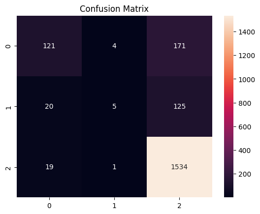
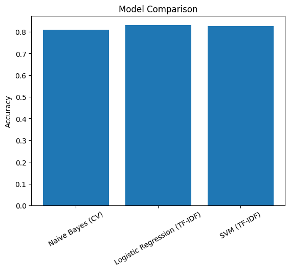

# Natural Language Processing for Sentiment Analysis of E-commerce Reviews
Name: Atharva Suryawansh

## Project Overview
This project aims to leverage Natural Language Processing (NLP) techniques to analyze customer reviews of e-commerce products. By harnessing the power of machine learning and sentiment analysis, the project seeks to provide insights into customer sentiments, enabling businesses to improve product offerings and enhance customer satisfaction.

## Features
- Sentiment analysis on customer reviews to determine positive, negative, and neutral sentiments.
- Data visualization capabilities to showcase sentiment trends over time.
- Easy integration with other e-commerce analytics tools.
- Comprehensive reporting features for stakeholders.

## Dataset

* Dataset: Amazon Product Reviews
* Source: Kaggle
* Features:

  * `reviewText` → Review text
  * `overall` → Rating (1–5)

### Sentiment Mapping

* 4–5 → Positive
* 3 → Neutral
* 1–2 → Negative

---

## NLP Preprocessing

The following preprocessing steps were applied:

* Tokenization
* Stopword removal
* Stemming using Porter Stemmer
* Lemmatization using WordNet Lemmatizer
* Removal of special characters and noise

---

## Text Vectorization

Two vectorization techniques were used:

* CountVectorizer
* TF-IDF with n-grams (1,2)

---

## Models Used

* Naive Bayes (CountVectorizer)
* Logistic Regression (TF-IDF)
* Support Vector Machine (TF-IDF)

---

## Model Performance

| Model                        | Accuracy |
| ---------------------------- | -------- |
| Naive Bayes (CV)             | 0.81     |
| Logistic Regression (TF-IDF) | 0.83     |
| SVM (TF-IDF)                 | 0.83     |

---

## Confusion Matrix Analysis

The confusion matrix shows the classification performance of the Logistic Regression model.

* The model correctly predicts a large number of **positive reviews**, indicating strong performance for majority class.
* Some confusion exists between **negative and positive classes**, which is common in sentiment datasets.
* The **neutral class has fewer correct predictions**, indicating it is harder to classify due to ambiguity in text.
* Overall, the model performs well but can be improved for minority classes.

---

## Model Comparison

* Logistic Regression and SVM achieved the highest accuracy (~0.83), showing strong performance with TF-IDF features.
* Naive Bayes performed slightly lower (~0.81) due to its assumption of feature independence.
* TF-IDF based models outperformed CountVectorizer as they capture word importance better.

---

## Evaluation Metrics

The models were evaluated using:

* Accuracy
* Precision
* Recall
* F1-score
* Confusion Matrix
* Cross-validation (optional)

---

## Sample Prediction

Input: "This product is amazing and worth the money"
Output: Positive

---

## Conclusion

* TF-IDF significantly improves model performance compared to CountVectorizer.
* Logistic Regression and SVM provide the best results for text classification tasks.
* NLP preprocessing plays a crucial role in improving classification accuracy.
* The model performs well overall but can be improved for neutral sentiment classification.

---

## Future Work

* Hyperparameter tuning
* Use of deep learning models (LSTM, BERT)
* Deployment using Streamlit
